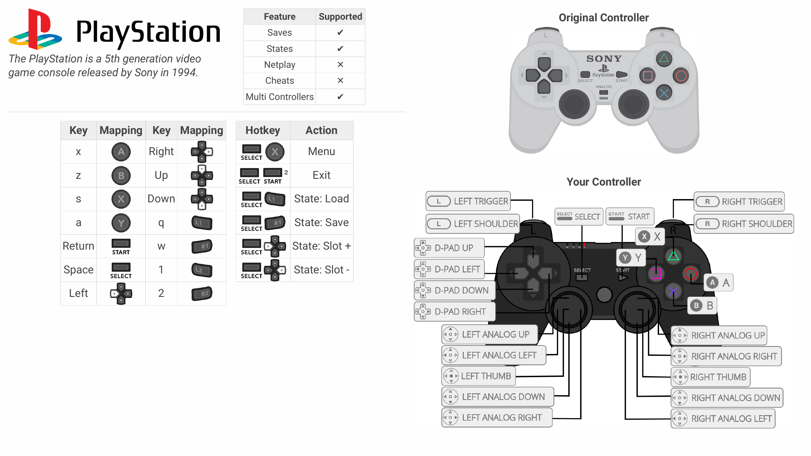
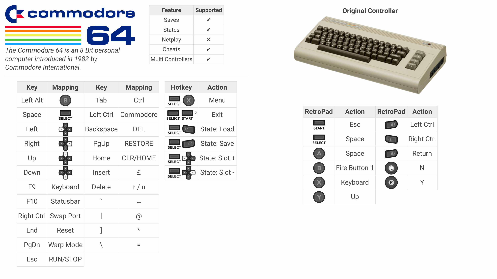
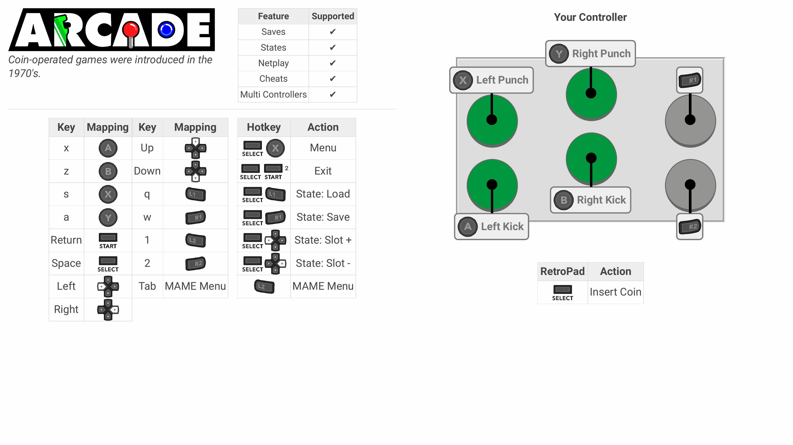
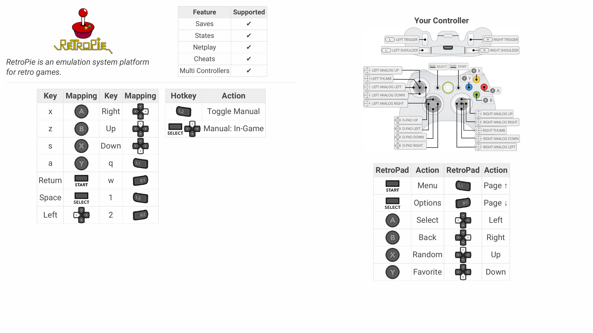

# Controls

When you start to increase the number of systems and emulators that you use, it becomes
really challenging to remember what buttons and keys do for each of those emulators.
Imagine building a system for a family member and then expecting them to figure out how
to control each system.

retrokit helps simplify that through reference sheets for each system that is available
directly through the UI.

## Reference Sheets

A reference sheet looks something like this:

This attempts to cover a few things:

* Give the user an overview of the system is that they're using
* Provide a brief highlight of what features the system supports
* Describe what each Keyboard key does
* Describe what each joystick button maps to on the original controller
* Provide images of the system's original controller
* Provide images of RetroArch's controller configuration

This reference documentation is generated specific to your system.  This means it'll use
the configurations available on your system in order to determine what shows up in the
reference sheet.

The reference sheet isn't intended to be exhaustive, but to cover the majority of use cases.

### How to use

Reference sheets are available at all times, whether browsing games in EmulationStation or
playing the game itself.  The default controls are:

| Context          | Keyboard    | Controller  |
| ---------------- | ----------- | ----------- |
| EmulationStation | M           | Select + Up |
| Game             | Select + Up | Select + Up |

This behavior is managed by [manualkit](manualkit.md).  If a game has a manual, then
the first page of the manual will always be shown first.  To view the reference sheet, simply
go back one page.

### System-specific overrides

Each system can provide its own customizations around how the reference sheet is built and
what content is available.  You can see the various overrides in the [docs](/docs/) folder.

For example, for the c64 system, vice configuration options are used to generate the following
reference sheet:

You can see a full list of example system reference documentation in the [manual/reference](examples/reference/)
folder.

System-specific integrations are provided for:

* c64
* daphne
* n64
* nes
* pc
* pcengine
* pce-cd

### Game-specific overrides

Additionally, sometimes individual games override what controls are available.  In those cases,
the reference sheet will account for those overrides.

For arcade systems, a visual representation of an arcade stick is used together with metadata
on what each button does to generate a reference sheet like so:

Arcade reference sheets are unique in this way because they're using information you've
provided about your panel layout, data that's been gathered on what buttons are available
in each game, and the current game that's being displayed in order to show to the user how
the joystick works.

Not all games have overrides and, in the case of arcade systems, not all games have known
button functions.  If you want to add more metadata about arcade games and their buttons,
you can add to the [Arcade Metadata file](/data/arcade.json).

### RetroPie reference

Before you've even started to use RetroPie, sometimes you just need to get started with
what controls are available to begin with.  To help with there, a RetroPie reference
sheet is also available:

## Defaults

For the most part, retrokit doesn't define many defaults when it comes to inputs.  However, it does
define the defaults for the keyboard.  You can find the current keyboard configuration provided
by retrokit at [config/controllers/inputs/Keyboard.cfg](/config/controllers/inputs/Keyboard.cfg).

The mappings provided are:

| RetroPad Button   | Key         |
| ----------------- | ----------- |
| Start             | Enter       |
| Select            | Space       |
| A                 | X           |
| B                 | Y           |
| X                 | S           |
| Y                 | A           |
| LS (L)            | Q           |
| RS (R)            | W           |
| LT (L2)           | 1           |
| RT (R2)           | 2           |
| Left Analog Up    | I           |
| Left Analog Right | L           |
| Left Analog Down  | K           |
| Left Analog Left  | J           |
| Hotkey            | Space       |

This is largely based on the [default Retroarch keyboard bindings](https://docs.libretro.com/guides/input-and-controls/#default-retroarch-keyboard-bindings).
For a list of hotkeys available across all libretro emulators, see the [RetroPie docs](https://retropie.org.uk/docs/Controller-Configuration/#hotkey).

## System configurations

If you need to manually override input configurations for certain emulators (other than
libretro cores), you can find some of those configurations listed below:

* config/systems/arcade/advmame.rc
* config/systems/dreamcast/redream.cfg
* config/systems/nds/drastic.cfg
* config/systems/psp/controls.ini

## Emulator controls

Sometimes it's helpful to understand what the native controls are for each emulator even
if retrokit provides quality-of-life features that make the controls consistent across
all of the emulators.  This section helps describe those controls.

### Exiting

| System            | Keyboard               |        Controller           |
| ----------------- | ---------------------- | --------------------------- |
| advmame           | Hotkey + Start (once)  | Hotkey + Start (once)       |
| dreamcast         | ESC                    | Select (to Menu)            |
| n64 (mupen64plus) | ESC                    | Hotkey + Start              |
| pc                | CTRL+F9                | None                        |
| nds               | ESC                    | Right Analog Left (to Menu) |
| psp               | ESC                    | Right Analog Left (to Menu) |
| manuals           | Hotkey + Up            | Hotkey + Up                 |
| *                 | Hotkey + Start (twice) | Hotkey + Start (twice)      |

It's too easy to accidentally hit a single button during gameplay, so emulators are generally
always configured to either go back to their native menu or require a second key / button press.

### Controllers

Some unique characteristics about how controllers are managed in each system.

| System        | Controller setup                                                  |
| ------------- | ----------------------------------------------------------------- |
| c64           | Switch Port 1 / 2 controller with virtual keyboard (Select)       |
| intellivision | Switch Left / Right controller with Select                        |
| videopac      | Requires 2 controllers (Left / Right controller is game-specific) |

### Menus

Each emulator has its own native menu interface.  Below describes those controls.

| System        | Keyboard   | Controller         |
| ------------- | ---------- | ------------------ |
| arcade - rgui | Hotkey + X | Hotkey + X         |
| arcade - mame | Tab        | L2                 |
| dreamcast     | Select     | Select             |
| nds           | Tab        | Right Analog Left  |
| psp           | N/A        | Right Analog Left  |
| *             | Hotkey + X | Hotkey + X         |

The following libretro MAME emulators support viewing the menu with a controller:

* lr-mame2015

### Cheats

As you might expect, controls are also unique to each emulator.  Below describes how to get to
cheats for each emulator.

| System        | Emulator      | How to Cheat                                       |
| ------------- | ------------- | -------------------------------------------------- |
| arcade        | lr-fbneo      | Options menu in Retroarch GUI                      |
| arcade        | lr-mame*      | Cheats menu in MAME GUI                            |
| dreamcast     | redream       | Cheats menu in Redream GUI                         |
| nds           | drastic       | Cheats menu in Drastic GUI                         |
| psp           | ppsspp        | Cheats menu in PPSSPP GUI ("Import from cheat db") |
| *             | lr-*          | Cheats menu in Retroarch GUI                       |

Cheats are not supported on the following systems / emulators:

* 3do
* arcade - lr-mame2010
* atari5200
* atari7800
* atarijaguar
* c64
* channelf
* gameandwatch
* intellivision
* mess
* neogeocd
* n64 - mupen64plus standalone
* pc
* pce-cd
* pcengine
* pokemini
* psx
* supergrafx
* vectrex
* videopac
* wonderswan
* wonderswancolor

## References

* [SDL Keycodes](https://wiki.libsdl.org/SDLKeycodeLookup)
